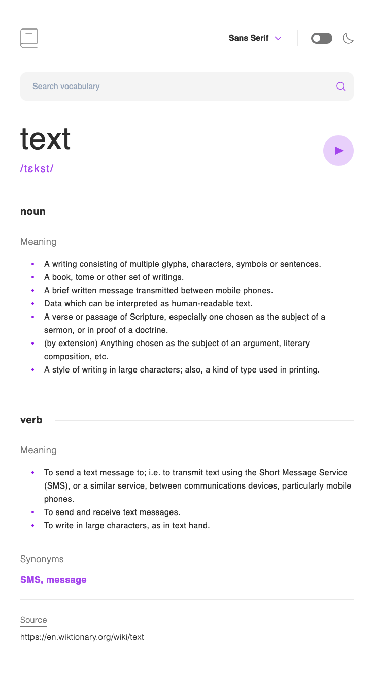
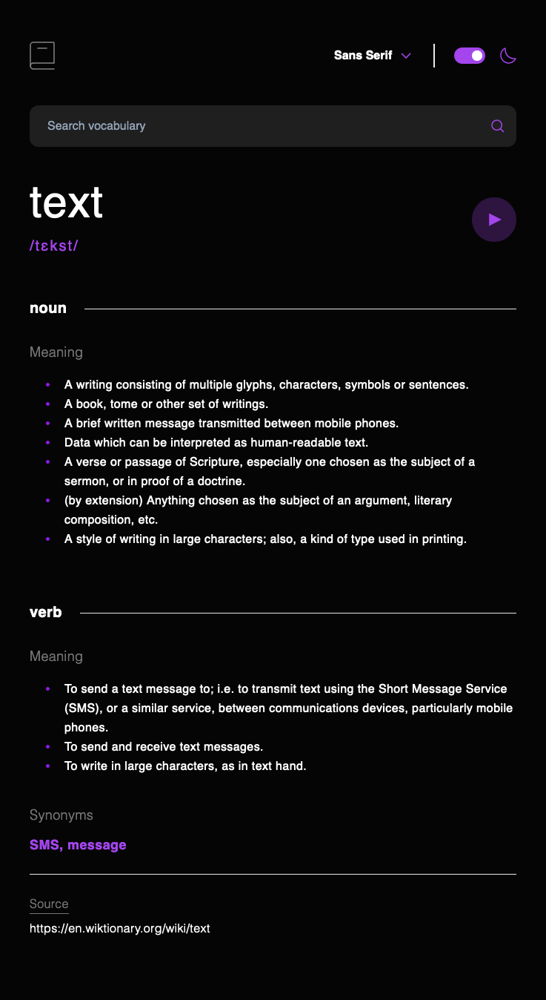

# Frontend Mentor - Dictionary web app solution

This is a solution to the [Dictionary web app challenge on Frontend Mentor](https://www.frontendmentor.io/challenges/dictionary-web-app-h5wwnyuKFL).

## Table of contents

- [Overview](#overview)
  - [The challenge](#the-challenge)
  - [Screenshot](#screenshot)
  - [Links](#links)
  - [Built with](#built-with)
  - [What I learned](#what-i-learned)
- [Author](#author)

## Overview

Build responsive dictionary app

### The challenge

Users should be able to:

- Search for words using the input field
- See the Free Dictionary API's response for the searched word
- See a form validation message when trying to submit a blank form
- Play the audio file for a word when it's available
- Switch between serif, sans serif, and monospace fonts
- Switch between light and dark themes
- View the optimal layout for the interface depending on their device's screen size
- See hover and focus states for all interactive elements on the page

### Screenshot




### Links

- Solution URL: [Add solution URL here](https://github.com/YoonJongok/dictionary-web)
- Live Site URL: [Add live site URL here](https://dictionary-web-ten.vercel.app)

### Built with

- [React](https://reactjs.org/) - JS library
- [Typescript](https://www.typescriptlang.org/) - JavaScript with syntax for types.
- [React Router Dom](https://reactrouter.com/en/main) - Router/Navigation
- [React query](https://tanstack.com/query/v3/) - Powerful asynchronous state management for TS/JS, React
- [Axios](https://axios-http.com/docs/intro) - promise-based HTTP Client for node.js and the browse
- [zod](https://github.com/colinhacks/zod) - TypeScript-first schema validation with static type inference
- [tailwind css](https://tailwindcss.com/) - For styles, Mobile-first workflow

### What I learned

Most of features were easy to implement. But i was struggling to adapt the font change immediately right after select the font option. And i learned how easy it is to change the font with basic js method in React.

```js
document.body.style.fontFamily = font.value;
```

## Author

- Frontend Mentor - [@YoonJongok](https://www.frontendmentor.io/profile/YoonJongok)

